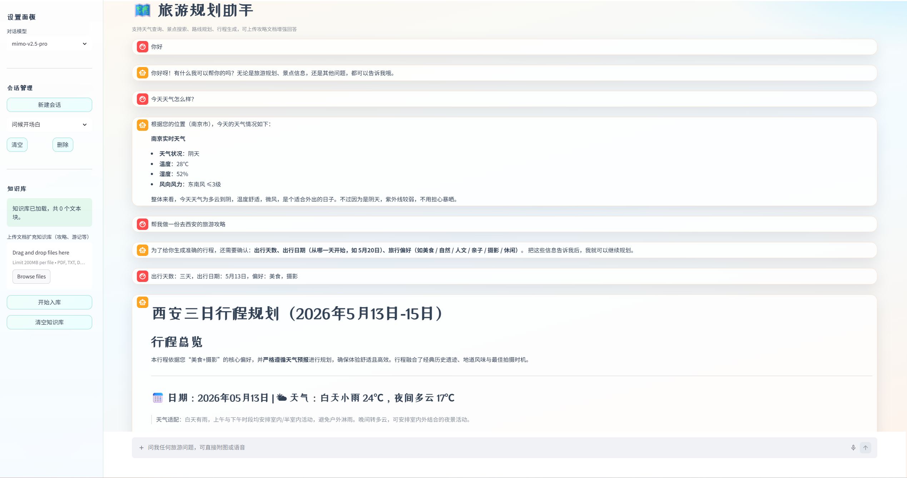

# Travel Assistant

一个基于 `Streamlit + LangGraph + LangChain + Chroma` 的中文旅游助手，支持旅游问答、行程规划、多模态输入与本地知识库检索（RAG）。

## 功能特性

- 多轮旅游对话（问天气、景点、美食、路线、距离等）
- 自动行程规划（按天拆分，结合天气预报与偏好生成可执行方案；恶劣天气自动安排室内活动）
- Researcher 节点采用 LLM 工具调用模式，自主决定调用哪些工具并行搜集信息
- 图片景点识别（结合视觉模型与地图信息补充）
- 语音转文字（音频输入后提取并参与问答）
- 本地文档入库与 RAG 检索（支持旅游资料增强回答）
- 多会话管理与持久化（会话自动重命名、切换、删除，重启后恢复）
- 节点执行过程实时可视化（Graphviz 流程图 + 耗时表格）

## 工作流说明

本项目采用 LangGraph 多节点流程：

1. `Router`：识别用户意图（规划行程 / 问答 / 车票查询 / 闲聊）并提取关键信息（城市、天数、出发日期、偏好）。
2. `Researcher`：通过 LLM 工具调用自主搜集信息——天气预报、景点、餐饮、路线、知识库等，多个工具并行执行。
3. `Planner`：基于汇总资料生成最终答复或完整行程。
4. `Ticket`：仅在用户明确查询车票/火车票/高铁票时调用 12306 查询能力。

不同意图会走不同路径：

- 行程规划：`router -> researcher -> planner -> END`
- 旅游问答 / 多模态识别 / RAG 问答：`router -> researcher -> END`
- 车票查询：`router -> ticket_agent -> END`
- 信息不足 / 闲聊 / 无法归类：`router -> END`

## 项目结构

```text
tour/
├─ agents/              # Router / Researcher / Planner / Ticket 工作流节点
│  ├─ graph.py           # LangGraph 图编排
│  ├─ router_node.py     # 意图识别与信息提取
│  ├─ research_node.py   # LLM 工具调用 + 并行搜集 + RAG 检索
│  ├─ planner_node.py    # 行程生成
│  ├─ ticket_node.py     # 车票查询
│  └─ state.py           # 状态定义
├─ core/                # LLM、工具、知识库管理
│  ├─ llm_core.py        # 多模型 LLM 初始化与缓存
│  ├─ tools.py           # 高德地图、天气、图片识别、语音转文字等工具
│  └─ db_manager.py      # Chroma 向量库管理（入库 / 清库）
├─ data/                # 运行时数据（不提交）
│  ├─ chroma_db/         # Chroma 向量库持久化
│  └─ uploads/           # 图片/语音上传缓存
├─ RAG/                 # 参考文档目录
├─ utils/
│  └─ config.py          # 环境变量与路径配置
├─ main.py              # Streamlit 入口
├─ UI.py                # UI 组件与样式
├─ api_key.env.example  # 密钥配置模板
├─ api_key.env          # 本地密钥配置
├─ requirements.txt     # 依赖列表
└─ README.md
```

## 运行环境

- Python 3.10 ~ 3.12

## 快速开始

1. 克隆项目并进入目录

```bash
git clone https://github.com/<你的用户名>/<你的仓库名>.git
cd tour
```

2. 创建并激活虚拟环境（推荐）

```bash
python -m venv .venv
```

Windows PowerShell：

```powershell
.\.venv\Scripts\Activate.ps1
```

macOS / Linux：

```bash
source .venv/bin/activate
```

3. 安装依赖

```bash
pip install -r requirements.txt
```

4. 在项目根目录复制模板并创建 `api_key.env`

```powershell
Copy-Item api_key.env.example api_key.env
```

然后填入本地密钥：

```env
AMAP_API_KEY=你的高德地图Key
ZHIPU_API_KEY=你的智谱Key
PROXY_API_KEY=你的代理或 Gemini Key
ALI_API_KEY=你的阿里百炼Key
MIMO_API_KEY=你的 MiMo Key
```

环境变量说明：

| 变量名 | 用途 |
| --- | --- |
| `AMAP_API_KEY` | 天气、景点、美食、路线查询（高德地图） |
| `ZHIPU_API_KEY` | GLM 模型与 embedding（智谱 AI） |
| `PROXY_API_KEY` | Gemini / 代理模型 |
| `PROXY_ENDPOINT` | 代理模型接口地址，默认 `http://127.0.0.1:7897` |
| `ALI_API_KEY` | Qwen 多模态与音频能力（阿里百炼） |
| `MIMO_API_KEY` | MiMo 模型（小米） |
| `MIMO_BASE_URL` | MiMo 接口地址，默认 `https://token-plan-cn.xiaomimimo.com/v1` |

5. 启动项目

```bash
streamlit run main.py
```

启动后浏览器会自动打开本地页面。

## 支持的模型

| 模型 | 提供方 | 用途 |
| --- | --- | --- |
| `glm-4.5-air` | 智谱 AI | 默认 Planner 模型 |
| `glm-4-flash` | 智谱 AI | 默认 Router 模型（轻量快速） |
| `glm-4.7-flash` | 智谱 AI | 轻量对话 |
| `gemini-3-flash` | Google | 通用对话 |
| `gemini-3.1-pro` | Google | 高质量对话 |
| `claude-opus-4-6-thinking` | Anthropic | 深度推理 |
| `qwen-turbo` / `qwen-plus` / `qwen-max` | 阿里百炼 | 通用对话（不同档位） |
| `qwen-vl-max` | 阿里百炼 | 图片识别 |
| `qwen-audio-turbo` | 阿里百炼 | 语音转文字 |
| `mimo-v2.5-pro` | 小米 | Researcher 工具调用模型 |
| `mimo-v2-omni` | 小米 | 多模态 |

## 使用说明

1. 在侧边栏选择模型，输入你的旅游问题或规划需求。
2. 需要行程时，请尽量提供城市、天数、偏好（如美食/人文/亲子）和出发日期。
3. 上传文档后可进行知识库问答，系统会自动切分并写入向量库。
4. 上传图片可识别景点信息；上传音频可转写后参与问答。
5. 支持多会话管理：新建、切换、删除会话，会话历史自动持久化到 `data/sessions.json`。

## 支持的知识库文件

- `pdf`
- `txt`
- `docx`
- `csv`

向量库默认持久化路径：`data/chroma_db/`。
上传的图片和语音会保存到 `data/uploads/`，用于支持当前会话内的后续追问；清空或删除会话时会自动回收对应文件。

## 近期优化

- Researcher 节点重构为 LLM 工具调用模式，由模型自主决定调用哪些工具，支持并行执行
- 工具调用失败时自动回退到原有并行搜集逻辑，保证可靠性
- Router 识别出发日期字段，支持”5月20号出发””下周一”等自然语言日期解析
- 行程规划集成天气预报，恶劣天气自动将户外活动调整为室内方案
- 多会话持久化：会话历史自动保存到 `data/sessions.json`，重启后恢复
- 会话自动重命名：根据首条消息生成有意义的会话标题
- 节点运行可视化：Graphviz 流程图 + 实时状态与耗时表格
- 增加 `.gitignore` 和 `api_key.env.example`，隔离密钥、向量库和 Python 缓存产物
