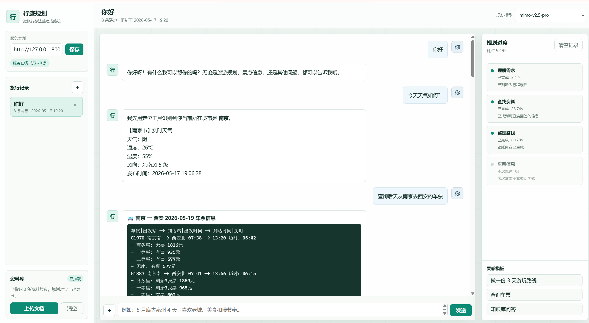
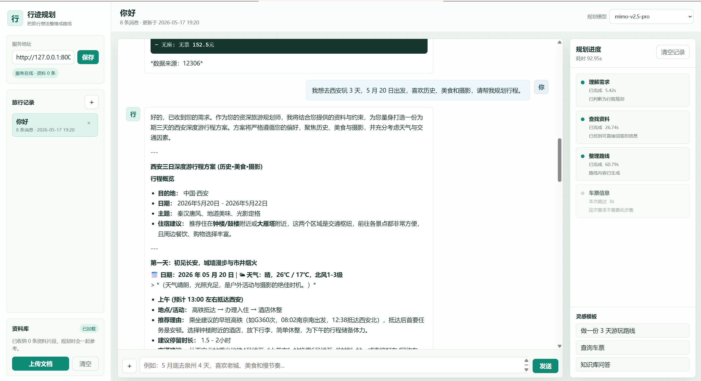

# Travel Assistant API

一个基于 `FastAPI + LangGraph + LangChain + Chroma` 的中文多 Agent 旅游规划后端。

## 界面预览




## 功能

- 多轮旅游对话：天气、景点、美食、路线、距离、知识库问答等
- 自动行程规划：Router 判断意图，Researcher 搜集资料，Planner 生成行程
- 车票查询：明确查询火车票/高铁票时进入 Ticket 节点
- 图片和语音输入：通过上传文件生成路径提示，交给 Agent 工具处理
- 本地知识库：支持 `pdf`、`txt`、`docx`、`csv` 入库和清空
- 后端会话管理：创建、读取、删除、清空会话，历史保存到 `data/sessions.sqlite3`

## 工作流

```text
router -> researcher -> planner -> END      # 行程规划
router -> researcher -> END                 # 旅游问答 / 图片识别 / 语音 / RAG
router -> ticket_agent -> END               # 车票查询
router -> END                               # 信息不足 / 闲聊 / 其他
```

## 项目结构

```text
tour_javascript/
├─ agents/                 # LangGraph 节点
│  ├─ graph.py
│  ├─ router_node.py
│  ├─ research_node.py
│  ├─ planner_node.py
│  ├─ ticket_node.py
│  └─ state.py
├─ core/
│  ├─ travel_service.py    # FastAPI 调用的服务层
│  ├─ llm_core.py
│  ├─ tools.py
│  ├─ db_manager.py
│  └─ mcp_client.py
├─ data/                   # 运行时数据，已加入 .gitignore
├─ RAG/
├─ utils/
│  └─ config.py
├─ main.py                 # FastAPI 入口
├─ api_key.env.example
├─ requirements.txt
└─ README.md
```

## 快速开始

```powershell
python -m venv .venv
.\.venv\Scripts\Activate.ps1
pip install -r requirements.txt
Copy-Item api_key.env.example api_key.env
```

在 `api_key.env` 中填入所需密钥：

```env
AMAP_API_KEY=你的高德地图Key
ZHIPU_API_KEY=你的智谱Key
PROXY_API_KEY=你的代理或 Gemini Key
ALI_API_KEY=你的阿里百炼Key
MIMO_API_KEY=你的 MiMo Key
```

启动后端：

```powershell
uvicorn main:app --reload --host 127.0.0.1 --port 8000
```

接口文档：

```text
http://127.0.0.1:8000/docs
```

如果 JavaScript 前端不在同源运行，可以通过环境变量配置 CORS：

```env
BACKEND_CORS_ORIGINS=http://localhost:5173,http://127.0.0.1:5173
```

未配置时默认允许所有来源，便于本地开发。

## 主要接口

### 健康检查

```http
GET /api/health
```

### 模型列表

```http
GET /api/models
```

### 普通聊天

```http
POST /api/chat
Content-Type: application/json
```

```json
{
  "message": "我想 5 月 20 日去杭州玩 3 天，偏好美食和人文",
  "session_id": null,
  "model": "glm-4.5-air",
  "save_to_session": true
}
```

返回字段包含：

- `session_id`：后端会话 ID
- `message`：最终回答
- `runtime`：各节点状态和耗时
- `events`：节点运行事件，前端可用于展示进度

### 流式聊天

```http
POST /api/chat/stream
Content-Type: application/json
```

返回 Server-Sent Events，事件名包括：

- `runtime`
- `node_update`
- `final`
- `error`

### 图片/语音聊天

```http
POST /api/chat/files
Content-Type: multipart/form-data
```

字段：

- `message`：文本，可为空
- `session_id`：可选
- `model`：可选
- `save_to_session`：可选，默认 `true`
- `files`：图片或音频文件

### 会话管理

```http
GET    /api/sessions
POST   /api/sessions
GET    /api/sessions/{session_id}
DELETE /api/sessions/{session_id}
DELETE /api/sessions/{session_id}/messages
```

### 知识库

```http
GET    /api/knowledge-base/status
POST   /api/knowledge-base/files
DELETE /api/knowledge-base
```

`POST /api/knowledge-base/files` 使用 `multipart/form-data` 上传 `files`，支持 `pdf`、`txt`、`docx`、`csv`。

## 支持的模型

模型列表维护在 `utils/config.py` 的 `MODEL_LIST` 中。默认 Planner 模型是 `glm-4.5-air`，Router 固定使用 `glm-4-flash`。

## 给前端的建议

- 首次进入页面先请求 `GET /api/models` 和 `GET /api/sessions`
- 普通文本对话调用 `POST /api/chat` 或 `POST /api/chat/stream`
- 图片/语音使用 `POST /api/chat/files`
- 知识库文档单独走 `/api/knowledge-base/files`
- 用 `runtime` 或 SSE 的 `node_update` 展示 Router、Researcher、Planner、Ticket 的执行状态
